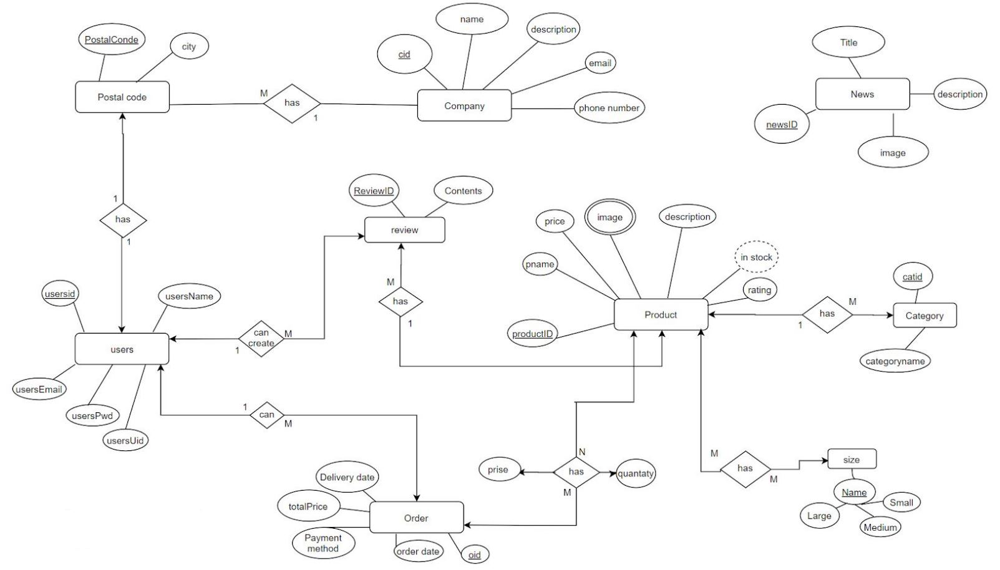
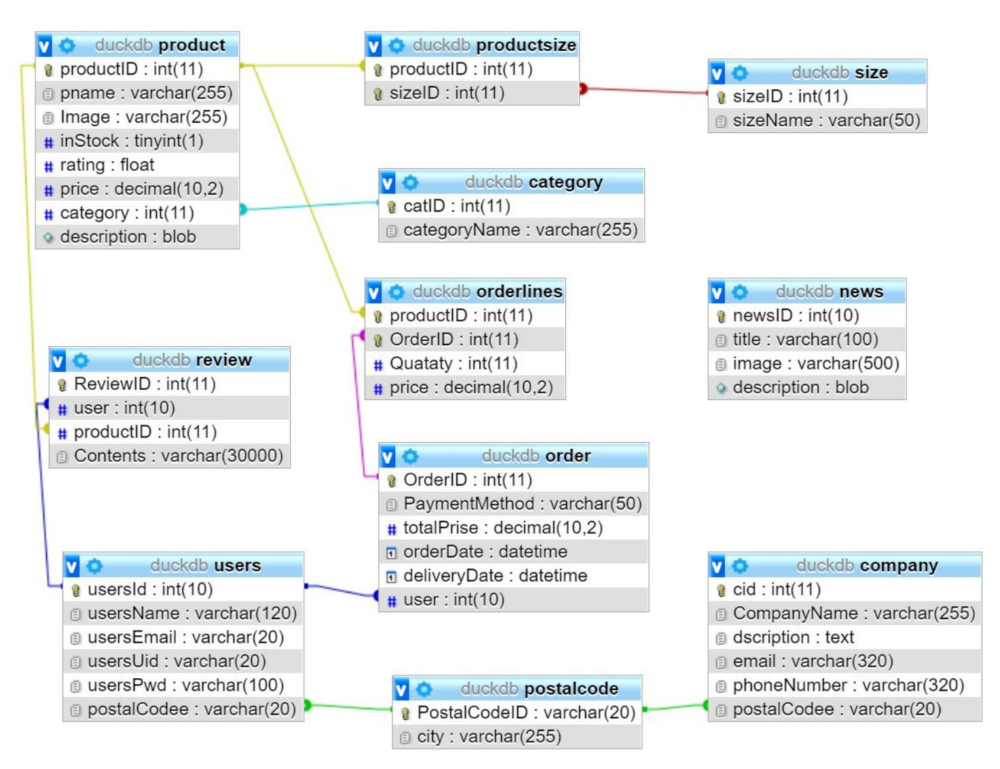

# Duck-Land
> A full stack web application that sells rubber ducks. 

## Pages
* Login / Register
* News page
* Products page
* Shopping cart

## Using
* PHP
vanilla php (plan original PHP without any framework)
* MySQL
Relational database

## Security
* SQL injection
* Prepared Statement
* Custom Captcha 
* Google reCAPTCHA v3
* Encryption and decryption (Hashing the password by bcrypt)
* Validate filters - Sanitize filters

## ER diagram 
* database schema
* normalization up to 3rd normal form

